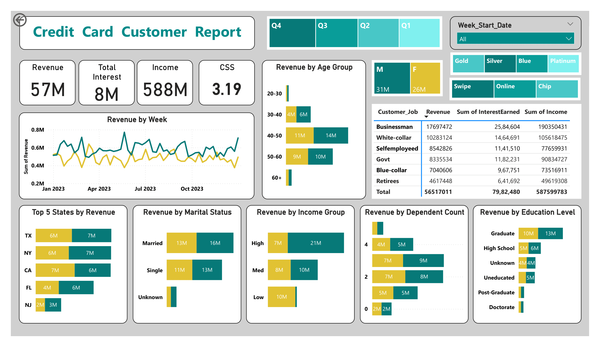
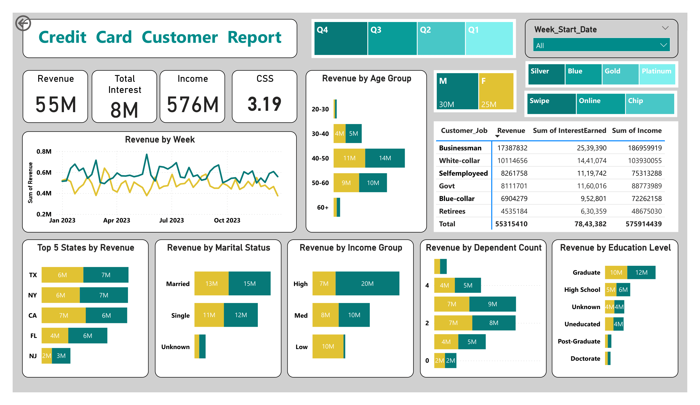
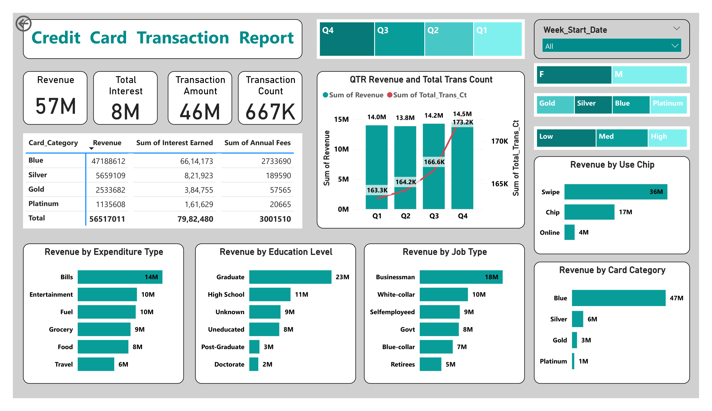

# Credit Card Financial Dashboard Power BI Project 📊

# ❓ Project Objective
To develop a comprehensive credit  card weekly dashboard that  provides real-time insights into key  performance metrics and trends,  enabling stakeholders to monitor  and analyze credit card operations  effectively.

# 🗂️ Dataset
1. Credit Card Financial Dataset
2. Credit Card Customer Dataset
3. Credit Card Financial Dataset Add week 53
4. Credit Card Customer Dataset Add week 53

# 🛠 Tools Used
1. Excel
2. SQL
3. MySQL
4. Power BI
5. DAX

# 📋 Steps
1. Prepare csv file in Excel
2. Create tables in SQL
3. import csv file into SQL
4. Connect MySQL Database with Power BI and Load Data
5. Data processing & DAX
6. Dashboard Creation & insights
7. Load week 53 (31st Dec) Data into SQL
8. Refresh Power BI Dashboard
9. Insights

# 📊 Credit Card Transaction Report Dashboard - Week 52 (24th Dec 2023)

📄 *[Download PDF Report](Weekly%20Dashboard%20pdf/Credit_Card_Transaction_Report-24-Dec-2023.pdf)*

# 📊 Credit Card Transaction Report Dashboard - Week 53 (31st Dec 2023)

📄 *[Download PDF Report](Weekly%20Dashboard%20pdf/Credit_Card_Transaction_Report-31-Dec-2023.pdf)*

# 📊 Credit Card Customer Report Dashboard - Week 52 (24th Dec 2023)

📄 *[Download PDF Report](Weekly%20Dashboard%20pdf/Credit_Card_Customer_Report-24-Dec-2023.pdf)*

# 📊 Credit Card Customer Report Dashboard - Week 53 (31st Dec 2023)

📄 *[Download PDF Report](Weekly%20Dashboard%20pdf/Credit_Card_Customer_Report-31-Dec-2023.pdf)*

# 📊 Dashboard Insights
📄 [View Dashboard Insights PDF](Weekly%20Dashboard%20pdf/Dashboard%20Insights.pdf)

# 📉 Project Insights- Week 53 (31st	Dec)

## Week on Week Change:  
Revenue increased by 28.8%  
Total Transaction Amt & Count increased by 35% & 3.4%    
Customer count increased by 12.8%  

## Overview Year to Date:  
Overall revenue is 57M  
Total interest is 8M  
Total transaction amount is 46M  
Male customers are contributing more in revenue 31M, female 26M  
Blue & Silver credit card are contributing to 93.5% of overall  transactions  
TX, NY & CA is contributing to 68.8%  
Overall Activation rate is 57.5%  
Overall Delinquent rate is 6.06%  

